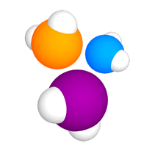

#   Автотест страницы 


<h2>  :hammer_and_wrench: Cтек </h2>
<p align="center">
  <a href="https://www.jetbrains.com/idea/"> </a>
  <a href="https://selenide.org/"> </a>
  <a href="https://aerokube.com/selenoid/"> </a>
  <a href="https://gradle.org/"> </a>
  <a href="https://github.com/allure-framework/allure2"> </a>
  <a href="https://github.com/"></a> 
  <a href="https://telegram.org"></a>
  <a href="https://www.jenkins.io/"> </a>
  <a href="https://www.java.com/"></a>
  <a href="https://junit.org/junit5/"> </a>
</p>

## :page_with_curl: Проверки

##   Сборка в [Jenkins](https://jenkins.autotests.cloud/job/Students/job/testX5Group/)  :gear:
<p align="center">

 </p>

__*Сборка:*__

## :rocket: Запуск тестов

__*Локально, из терминала:*__
```
gradle clean test
```
__*Удаленно, из терминала:*__
```
gradle clean test -DisRemote=true
```
__*Удаленно, из Jenkins:*__


### Фаил test.properties
Для запуска теста локально нужно создать фаил в папке resources (src/test/resources) и необходимо указать следующее параметры
```
selenoid_UserName = UserName
selenoid_Password = Password
selenoid_Url = Url
```
## :bar_chart: Пример отчета о прохождении тестов в Allure и Telegram


|         Allure         |  Allure |
|:-------------------------------------------------------------------------------------------:|:------------------------------------------------------------------------:|

<p align="center">
Telegram
</p>
<p align="center">
                                                                        
 </p>


###  Видео теста на Selenoid
